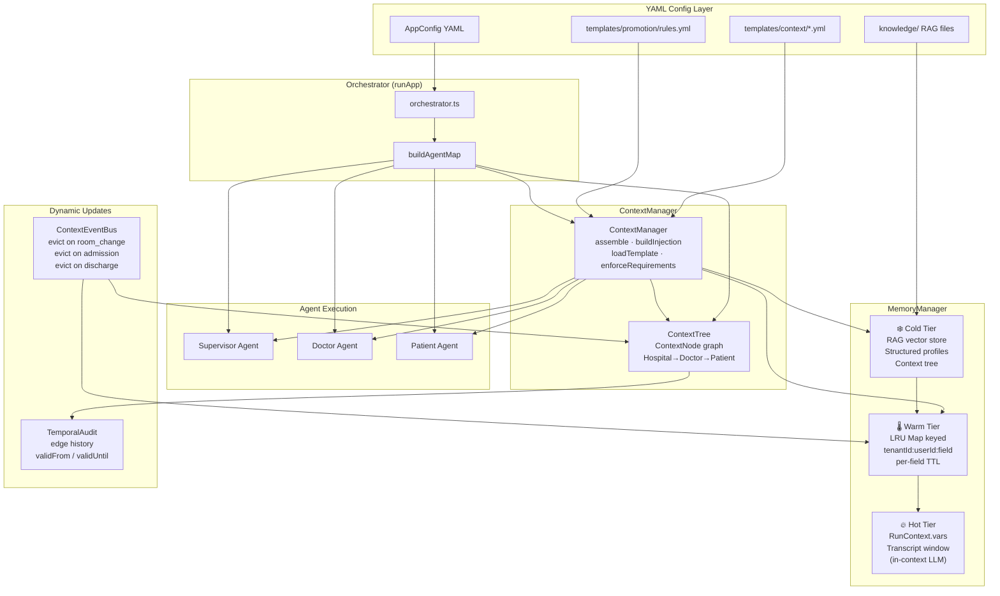
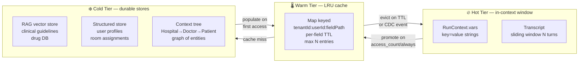
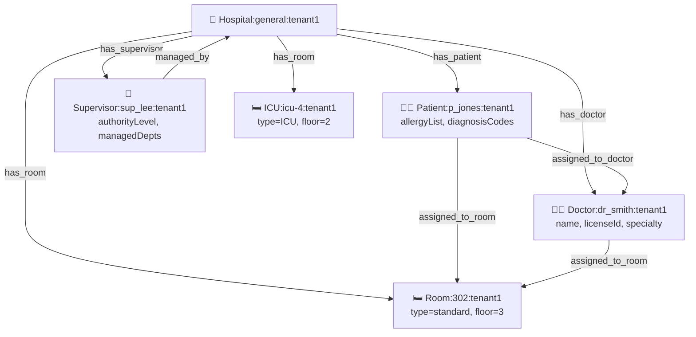
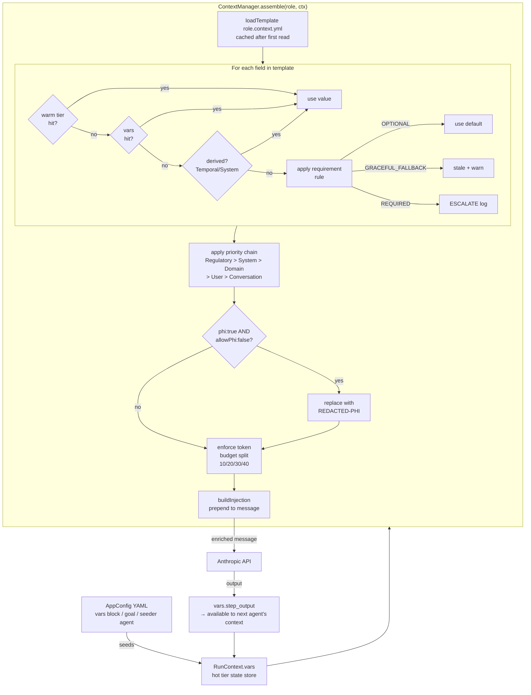
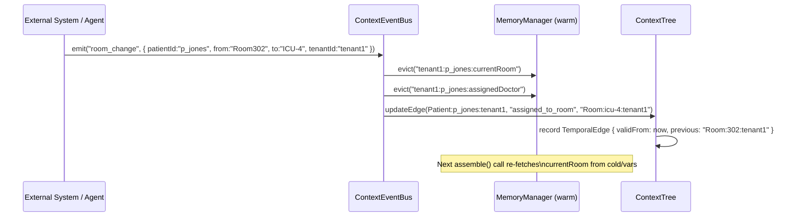
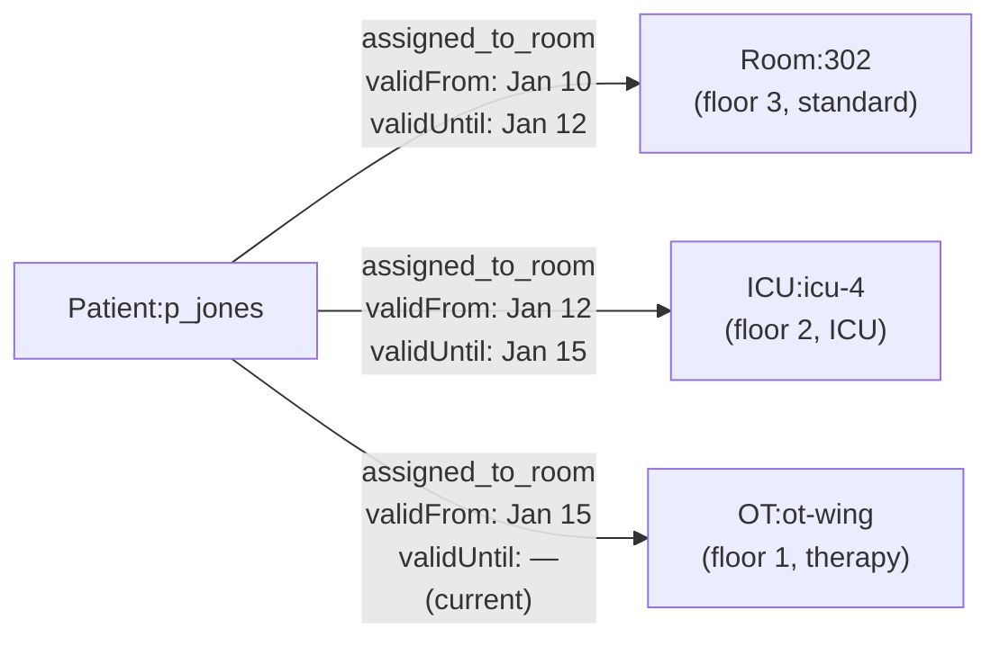
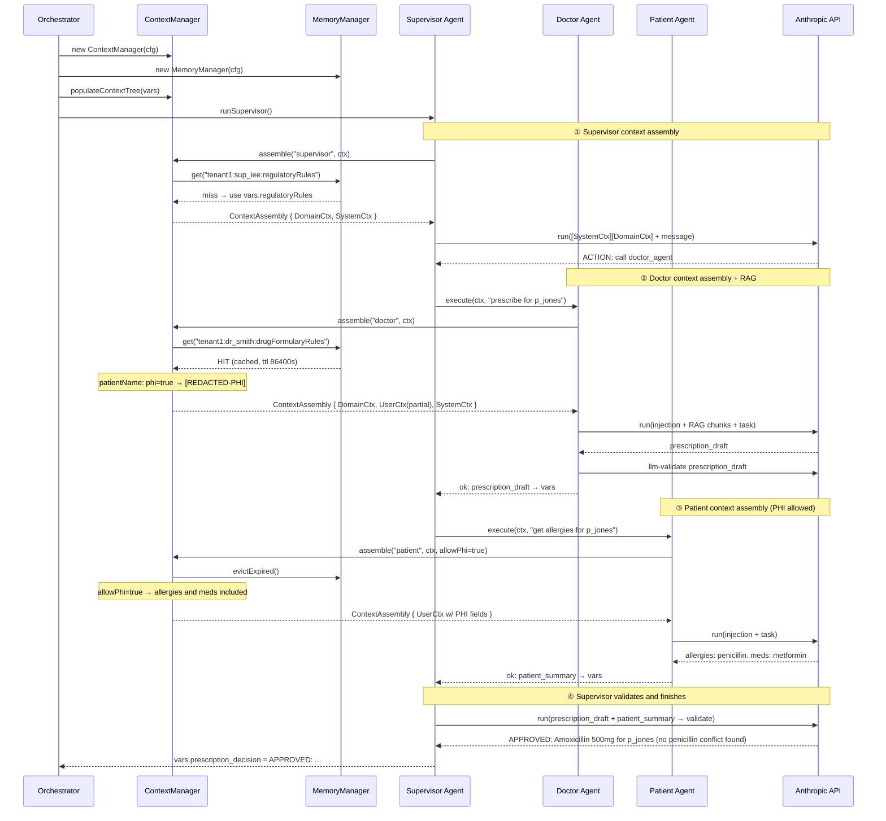

# ContextManager + MemoryManager — Design Document

> **Status:** Design approved, implementation pending.  
> **Domain:** Hospital management (Doctor, Patient, Supervisor, Room, Hospital)  
> **Framework:** Config-driven multiagent framework (TypeScript / Anthropic Claude)

---

## Table of Contents

1. [Overview](#1-overview)
2. [Architecture Block Diagram](#2-architecture-block-diagram)
3. [Six Context Types](#3-six-context-types)
4. [Memory Manager — Three Tiers](#4-memory-manager--three-tiers)
5. [Context Tree Structure](#5-context-tree-structure)
6. [How to Extend — The Four-Step Model](#6-how-to-extend--the-four-step-model)
7. [Context Population Data Flow](#7-context-population-data-flow)
8. [Dynamic Context Updates](#8-dynamic-context-updates)
9. [Hospital Prescription — Sequence Diagram](#9-hospital-prescription--sequence-diagram)
10. [Six Context Challenges and Fixes](#10-six-context-challenges-and-fixes)
11. [Six Memory Manager Challenges and Fixes](#11-six-memory-manager-challenges-and-fixes)
12. [Hospital Example — Config Sketch](#12-hospital-example--config-sketch)
13. [Design Principles](#13-design-principles)
14. [Architecture Decision Records](#14-architecture-decision-records)
15. [Training vs MemoryManager Decision Guide](#15-training-vs-memorymanager-decision-guide)

---

## 1. Overview

The ContextManager + MemoryManager layer sits **between the YAML config and each agent's LLM call**. Its job is to assemble a structured, role-specific context block and prepend it to every agent message — so the model always has the right information without the prompt author having to hard-code it.

```
YAML config  →  Orchestrator  →  ContextManager.assemble()  →  enriched message  →  Anthropic API
                                         ↑
                               MemoryManager (warm LRU)
                               ContextTree (entity graph)
                               RetrievalStores (cold RAG)
```

**Key properties:**

- **Opt-in** — absent `contextManager:` block = zero behavior change; all 8 existing configs work unchanged.
- **Config-driven** — a new domain (e.g., insurance, pharma) needs only new YAML templates and prompt files, no TypeScript.
- **PHI-safe** — `phi: true` fields are hard-blocked from warm tier and redacted when `allowPhi: false`.
- **Dynamic** — context fields carry TTLs and can be evicted by events, so stale data never silently poisons a model call.

---

## 2. Architecture Block Diagram



---

## 3. Six Context Types

| # | Type | What it carries | TTL range | PHI risk |
|---|------|----------------|-----------|----------|
| 1 | **UserContext** | identity, role profile (DoctorProfile / PatientProfile / SupervisorProfile), auth, cross-refs | 15 min – 1 hr | High (patient fields) |
| 2 | **DomainContext** | business rules, ontology, regulatory constraints, SLA thresholds | 1 hr – 24 hr | Low |
| 3 | **SystemContext** | model identity, tool registry, feature flags, rate limits | Permanent (ttl: 0) | None |
| 4 | **ConversationContext** | windowed message history, active intent, NER entities, token budget remaining | Per-turn | Low |
| 5 | **RetrievalContext** | RAG chunks stamped with `embeddingModelId` + version, source freshness | 15 – 30 min | High (patient history) |
| 6 | **TemporalContext** | request timestamp, shift info, fiscal period, model cutoff reference | Per-request | None |

### Field requirement levels

| Level | Behaviour when missing |
|-------|----------------------|
| `REQUIRED` | Log `ESCALATE` warning; supervisor agent notified; run continues with empty value |
| `OPTIONAL` | Use declared `default:` value silently |
| `GRACEFUL_FALLBACK` | Use last known stale value + emit a warning in trace log |

### Token budget split (default)

```
System context    10 %  ← placed at prompt START (Lost-in-the-Middle finding)
User context      20 %  ← placed at prompt START
Domain context    30 %
Conversation      40 %  ← most recent turns verbatim; older compressed
```

---

## 4. Memory Manager — Three Tiers



### Promotion triggers

| Trigger | When it fires |
|---------|--------------|
| `always` | On every `set()` call — field always goes into warm tier |
| `access_count` | When `get()` call count ≥ `accessCountThreshold` (default 3) |
| `explicit` | Only when `memoryManager.promote(key)` is called directly |

**PHI hard-block:** `phi: true` fields are **never written to warm tier** regardless of promotion trigger. They are resolved fresh from cold/vars on every call.

---

## 5. Context Tree Structure

The context tree is an in-memory directed graph of hospital entities. Cross-references are stored as **edge pointers, never embedded copies** — the same patient node is shared across doctor and supervisor views.



### Node identity format

```
NodeType:entityId:tenantId
e.g.  Patient:p_jones:tenant1
      Room:icu-4:tenant1
```

### Edge labels

`has_doctor` · `has_patient` · `has_supervisor` · `has_room` · `assigned_to_doctor` · `assigned_to_room` · `managed_by` · `dual_role`

---

## 6. How to Extend — The Four-Step Model

Any new domain (insurance, pharma, education) follows this pattern. **Zero TypeScript changes required after the feature ships.**

### Step 1 — Write a context template per role

Create one YAML file per role under `templates/context/`:

```yaml
# templates/context/doctor.context.yml
role: doctor
fields:
  doctorId:
    type: UserContext
    ttl: 3600
    requirement: REQUIRED
    phi: false
    promote: always
    promote_ttl: 7200

  licenseNumber:
    type: UserContext
    ttl: 3600
    requirement: REQUIRED
    phi: false
    promote: access_count   # promote after 3 accesses

  patientName:
    type: UserContext
    ttl: 900
    requirement: OPTIONAL
    phi: true               # hard-blocked from warm tier
    promote: explicit

  currentShift:
    type: TemporalContext
    ttl: 1800
    requirement: OPTIONAL
    phi: false
    promote: always

  drugFormularyRules:
    type: DomainContext
    ttl: 86400
    requirement: REQUIRED
    phi: false
    promote: always

  patientHistory:
    type: RetrievalContext
    ttl: 1800
    requirement: GRACEFUL_FALLBACK
    phi: true
    promote: explicit

  modelId:
    type: SystemContext
    ttl: 0                  # never expires
    requirement: REQUIRED
    phi: false
    promote: always
```

### Step 2 — Seed context variables (three ways)

**A. Explicit `vars:` block in YAML config**
```yaml
vars:
  tenantId: "tenant1"
  doctorId: "dr_smith"
  patientId: "p_jones"
  currentShift: "morning"
```

**B. Agent step output (each `output:` key becomes `vars.<name>`)**
```yaml
workflow:
  steps:
    - agent: context_seeder      # calls DB or API
      input:  "{{goal}}"
      output: patientId          # → vars.patientId available to all later agents
    - agent: doctor_agent
      input:  "Patient {{patientId}}: {{goal}}"
      output: prescription_draft
```

**C. First-step seeder agent** — a lightweight agent whose only job is to fetch dynamic data (room assignment, shift info, etc.) and write it to output vars before the main workflow runs.

### Step 3 — Point each agent to its template

```yaml
agents:
  - id: doctor_agent
    contextRole: doctor          # loads templates/context/doctor.context.yml
    ...
  - id: hospital_supervisor
    contextRole: supervisor
    ...
```

### Step 4 — Enable at the app level

```yaml
contextManager:
  templateDir:         ../templates/context
  promotionRulesFile:  ../templates/promotion/promotion.rules.yml
  allowPhi:            true          # tenant-level PHI gate

memoryManager:
  warmTierMaxEntries:  500
  defaultTtlSeconds:   600
  accessCountThreshold: 3
```

---

## 7. Context Population Data Flow



---

## 8. Dynamic Context Updates

> **Requirement:** Patient moves Room1 → Room2 → ICU → Occupational Therapy over several days. How does the context stay current?

### The problem

Without a dynamic update mechanism, the warm-tier cache will serve the old room assignment until the TTL expires. Worse, the context tree still has the old `assigned_to_room` edge. A doctor agent asking "where is my patient?" gets a stale answer.

### Solution: ContextEventBus + Temporal Edges

Three complementary mechanisms handle this:

#### 8.1 Short TTL on location fields

Set `ttl: 300` (5 min) on `currentRoom` and `currentUnit` fields in the context template. After 5 minutes without a cache hit, the warm tier treats the value as expired and re-fetches from cold/vars. This is the lowest-effort fix and handles *gradual* drift.

```yaml
# templates/context/patient.context.yml
fields:
  currentRoom:
    type: UserContext
    ttl: 300                    # 5 min — location changes frequently
    requirement: GRACEFUL_FALLBACK
    phi: false
    promote: always
    evict_on: [room_change, admission, discharge, transfer]
```

#### 8.2 ContextEventBus — event-driven cache eviction

An in-process event bus that fires when domain state changes. Any agent or external integration can emit an event; the bus immediately evicts matching warm-tier keys.



**Event types to handle:**

| Event | Fields evicted | Context tree update |
|-------|---------------|---------------------|
| `room_change` | `currentRoom`, `assignedNurse` | update `assigned_to_room` edge |
| `admission` | `admissionStatus`, `ward` | add patient node + edges |
| `discharge` | all patient fields | remove/archive patient node |
| `transfer` | `currentUnit`, `currentRoom`, `attendingDoctor` | update room + doctor edges |
| `doctor_reassignment` | `attendingDoctor` | update `assigned_to_doctor` edge |
| `diagnosis_update` | `diagnosisCodes`, `treatmentPlan` | update patient node data |

#### 8.3 Temporal Edges — full movement history in the context tree

Instead of overwriting the `assigned_to_room` edge on every move, store it as a **temporal edge** with `validFrom` / `validUntil` timestamps. This preserves the full patient journey.



The context tree `getNeighbors()` API accepts an optional `{ at: Date }` parameter:
- `getNeighbors(patientId, "assigned_to_room")` → current room (no timestamp = latest)
- `getNeighbors(patientId, "assigned_to_room", { at: new Date("2025-01-13") })` → ICU-4

#### 8.4 Seeder agent pattern for dynamic pre-run population

For real-time data, add a `context_seeder` agent as the **first step** in any workflow. Its job is to emit an event (or write to vars) before any clinical agent runs:

```yaml
# configs/hospital-prescription.yaml
workflow:
  steps:
    - agent: context_seeder
      input:  "Fetch current state for patient {{patientId}} in tenant {{tenantId}}"
      output: context_seed_done
    - agent: doctor_agent
      input:  "{{goal}}"
      output: prescription_draft
```

The seeder agent's prompt instructs it to call an `http_get` tool to fetch the EMR API, then output a JSON blob that the framework writes to `vars`. The ContextEventBus fires on the seeder's output via a promotion hook.

#### 8.5 Summary: which mechanism for which scenario

| Scenario | Recommended mechanism |
|----------|-----------------------|
| Location changes every few hours | Short TTL (300–600s) on location fields |
| Real-time room change (EHR event) | ContextEventBus → evict + tree updateEdge |
| Need full patient movement history | Temporal edges with validFrom/validUntil |
| Pulling live data before each run | context_seeder agent as first workflow step |
| Batch nightly refresh | Cold-tier store refresh + evictAll(pattern) |

---

## 9. Hospital Prescription — Sequence Diagram



---

## 10. Six Context Challenges and Fixes

| # | Challenge | Fix |
|---|-----------|-----|
| **C-1** | **Window overflow** — context grows past model's token limit | Token budget split 10/20/30/40; `system` + `user` sections placed at prompt START (Lost-in-the-Middle); older conversation turns compressed to summaries |
| **C-2** | **Stale poisoning** — outdated data silently accepted by model | Per-field `ttl` in YAML; `evict_on` event list triggers immediate warm-tier eviction; safety-critical `REQUIRED` fields abort (ESCALATE) if missing |
| **C-3** | **Context collision** — two sources provide conflicting values | Priority chain: `Regulatory > System > Domain > User > Conversation`; all overrides logged to audit trail |
| **C-4** | **Permission bleed** — one tenant/user sees another's data | Cache keys namespaced `tenantId:userId:fieldPath`; `validateOwnership()` on every warm-tier read; PHI scrubbed at serialization boundary |
| **C-5** | **Embedding version mismatch** — RAG chunks from stale index | Every chunk stamped with `embeddingModelId` + `version`; `EmbeddingVersionGuard` blocks mismatched queries; blue-green shadow index promotion |
| **C-6** | **Missing context degradation** — model hallucinates missing facts | MVC schema enforcement: `REQUIRED` missing → ESCALATE + empty value; `OPTIONAL` → declared default; `GRACEFUL_FALLBACK` → last stale value + warning |

---

## 11. Six Memory Manager Challenges and Fixes

| # | Challenge | Fix |
|---|-----------|-----|
| **M-1** | **Cache key collision** — two tenants' data overwrites each other | Three-part key: `tenantId:userId:fieldPath` — collision is mathematically impossible across tenants |
| **M-2** | **PHI in warm tier** — regulated data cached insecurely | Hard-block in `promote()`: if `field.phi === true`, skip LRU write entirely regardless of promotion trigger |
| **M-3** | **Stale value served** — TTL expires but entry still returned | Per-field `expiresAt` checked on every `get()`; `evictExpired()` sweep called before every `assemble()` |
| **M-4** | **Hallucination admission** — fabricated values entered into cache | Admission scorer cross-checks source provenance before `set()`: values without a known source tag are rejected |
| **M-5** | **Embedding version mismatch** — cold-tier RAG returns wrong-version chunks | Chunk stamps checked at retrieval time; mismatched version → treat as cache miss and return warning |
| **M-6** | **Cache pressure cascade** — high-priority fields evicted under load | Priority 1–5 declared in YAML; priority-1 fields (`REQUIRED` + `DomainContext`) never evicted mid-session; only priority 3–5 participate in LRU eviction |

---

## 12. Hospital Example — Config Sketch

```yaml
# configs/hospital-prescription.yaml
name: hospital-prescription-workflow
pattern: supervisor

llm:
  model: claude-sonnet-4-6
  apiKeyEnv: ANTHROPIC_API_KEY
  maxTokens: 4096

goal: "Doctor dr_smith submits a prescription for patient p_jones. Supervisor sup_lee must validate it against the drug formulary and patient history before approving."

vars:
  tenantId:     "tenant1"
  doctorId:     "dr_smith"
  patientId:    "p_jones"
  supervisorId: "sup_lee"
  currentShift: "morning"

contextManager:
  templateDir:         ../templates/context
  promotionRulesFile:  ../templates/promotion/promotion.rules.yml
  allowPhi:            true

memoryManager:
  warmTierMaxEntries:   500
  defaultTtlSeconds:    600
  accessCountThreshold: 3

retrievalStores:
  - id: drug_formulary
    type: local_files
    dir: ../knowledge/hospital

agents:
  - id: hospital_supervisor
    description: "Validates prescription requests against regulatory rules and patient history"
    promptFile:  ../prompts/hospital/hospital_supervisor.md
    contextRole: supervisor

  - id: doctor_agent
    description: "Submits a prescription for a patient based on clinical assessment and formulary rules"
    promptFile:  ../prompts/hospital/doctor_agent.md
    contextRole: doctor
    retrieval:
      store: drug_formulary
      topK: 3
    validate:
      type: llm
      criteria: "The prescription must include drug name, dosage, and patient ID and must not contradict the formulary rules."
      onFail: warn

  - id: patient_agent
    description: "Provides patient medical history, allergies, and current medications"
    promptFile:  ../prompts/hospital/patient_agent.md
    contextRole: patient

supervisorConfig:
  supervisor:          hospital_supervisor
  workers:             [doctor_agent, patient_agent]
  input:               "{{goal}}"
  maxTurns:            10
  output:              prescription_decision
  tokenBudget:         60000
  contextWindowTurns:  6
```

### Directory layout after implementation

```
multiagent-framework/
├── configs/
│   └── hospital-prescription.yaml
├── templates/
│   ├── context/
│   │   ├── doctor.context.yml
│   │   ├── patient.context.yml
│   │   └── supervisor.context.yml
│   └── promotion/
│       └── promotion.rules.yml
├── prompts/
│   └── hospital/
│       ├── doctor_agent.md
│       ├── patient_agent.md
│       └── hospital_supervisor.md
├── knowledge/
│   └── hospital/
│       ├── drug_formulary.txt
│       ├── patient_history.txt
│       └── regulatory_rules.txt
└── src/
    ├── context/
    │   ├── contextTypes.ts
    │   ├── contextTree.ts
    │   ├── memoryManager.ts
    │   └── contextManager.ts
    └── ... (existing files unchanged)
```

---

## 13. Design Principles

1. **Opt-in, never breaking** — new features activate only when present in YAML; absent = current behavior.
2. **No duplication** — `retrieval.ts` is cold-tier RAG; `transcript.ts` is hot-tier window; `vars` is hot-tier state. New layers wrap, not replace.
3. **Config-driven end-to-end** — a new domain requires only YAML + prompt files; no TypeScript changes after feature ships.
4. **PHI hard-block** — `phi: true` fields never enter warm tier; redacted to `[REDACTED-PHI]` when `allowPhi: false`.
5. **Typed requirements** — `REQUIRED` missing → ESCALATE; `OPTIONAL` → default; `GRACEFUL_FALLBACK` → stale + warn.
6. **Token discipline** — context injection respects a declared split budget; system + user sections always at prompt start.
7. **Priority chain for collisions** — Regulatory > System > Domain > User > Conversation; all overrides logged.
8. **Event-driven freshness** — location/assignment fields carry short TTLs and `evict_on` event triggers; no polling needed.
9. **Temporal audit trail** — context tree edges carry `validFrom`/`validUntil`; full patient journey preserved, not just current state.
10. **Least privilege by default** — `tools:` allow-list on agents; `contextRole:` gates which context types each agent sees.
11. **Structured failures, never silent** — budget exhaustion, missing REQUIRED fields, validation failures all produce typed signals; nothing swallowed.
12. **382M + memory ≥ 7B parametric** — per Jin et al. 2024: a smaller model with external memory matches a larger model's factual precision; don't fine-tune what should live in MemoryManager.

---

## 14. Architecture Decision Records

### ADR-1: Delimiter protocol over JSON for supervisor decisions

**Decision:** Use `ACTION: call\nWORKER: id\n<<<\npayload\n>>>` instead of JSON.

**Reason:** Multi-line code payloads (prescriptions, clinical notes) contain unescaped newlines and quotes that break JSON parsing. The delimiter protocol handles arbitrary content safely with a fallback regex for truncated responses.

**Consequence:** Protocol parsing is in `src/protocol.ts`; all supervisor/hierarchical patterns use it.

---

### ADR-2: Warm tier is in-process memory only

**Decision:** The warm LRU Map is ephemeral — process restart = cold start.

**Reason:** Persistence adds complexity (Redis, file I/O) without meaningful benefit for the session-scoped use case. The cold tier (RAG + structured store) is the durable source of truth; warm tier is a speed layer.

**Consequence:** Multi-process deployments need an external cache (Redis) if warm-tier sharing is required. This is a documented future extension point.

---

### ADR-3: PHI never in warm tier, regardless of promotion trigger

**Decision:** `promote()` in MemoryManager checks `field.phi` before any LRU write. If `phi === true`, the write is silently skipped.

**Reason:** Warm tier may be inspected via logs, heap dumps, or shared in a multi-tenant process. PHI fields must never appear there — even `explicit` promotion is blocked.

**Consequence:** PHI-tagged fields are always resolved fresh from cold/vars, paying a latency cost on every call. This is intentional.

---

### ADR-4: Context tree edges are temporal by design

**Decision:** `ContextEdge` includes optional `validFrom: Date` and `validUntil: Date`. `getNeighbors()` defaults to current-time query.

**Reason:** Hospital workflows need both current state ("where is the patient now?") and historical queries ("which room was the patient in on Jan 13?"). Overwriting edges loses this history.

**Consequence:** Edge storage grows over time. A TTL-based archival policy (move edges older than 90 days to cold store) is a recommended operational practice.

---

### ADR-5: ContextManager assembles, agents do not negotiate

**Decision:** The ContextManager produces a finished injection string before the agent's LLM call. Agents never ask for more context mid-turn via a protocol message.

**Reason:** Context negotiation (agent requests field → framework fetches → re-injects) adds a round-trip API call and complicates the execution model. Pre-assembly at `execute()` entry is synchronous and predictable.

**Consequence:** If an agent determines mid-turn that it needs additional context (e.g., discovers a drug interaction requiring a different patient record), it must use a `tool` call (`http_get` or `file_read`) rather than requesting a context re-assembly.

---

### ADR-6: `vars:` top-level block added to AppConfig

**Decision:** Allow a `vars:` map at the YAML root to pre-seed `RunContext.vars` before any agent runs.

**Reason:** Without this, seeding context fields (tenantId, patientId, etc.) requires either a no-op seeder agent or embedding them in the `goal` string — both are awkward.

**Consequence:** Adds one optional field to `AppConfigSchema`; fully backward-compatible.

---

## 15. Training vs MemoryManager Decision Guide

> Key finding (Jin et al. 2024): strong parametric memory causes LLMs to **ignore correct external evidence** (Dunning-Kruger effect). A 382M model + external memory matches LLaMA2-7B factual precision.

| Use fine-tuning for | Use MemoryManager for |
|--------------------|-----------------------|
| Clinical reasoning style and tone | PHI-adjacent patient data |
| Stable procedural knowledge (how to write a prescription note) | Permission and role assignments |
| Domain vocabulary and abbreviations | Live drug databases and formularies |
| Consistent output format | Hospital policies (change frequently) |
| Persona / communication style | Anything requiring audit trail or deletion |
| | Room and bed assignments (dynamic) |
| | Diagnosis codes (update per visit) |
| | Any field with TTL < 24 hours |

**Rule of thumb:** if a fact could legally require deletion (GDPR, HIPAA right-to-erasure) or changes more than once a year, put it in MemoryManager, not model weights.
